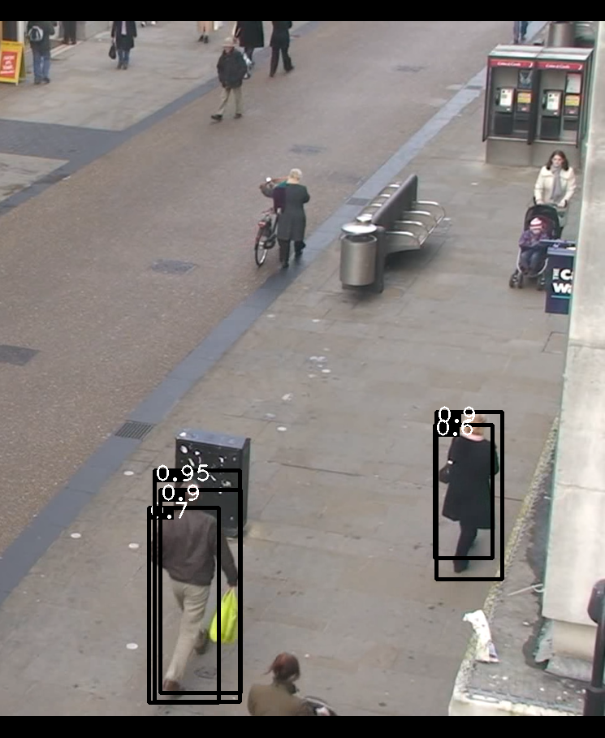
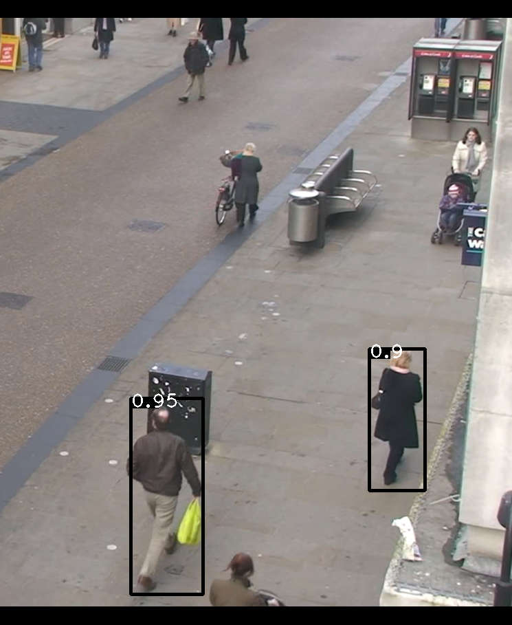

# 非极大值抑制算法

## 简介

非极大值抑制算法（Non-Maximum Suppression，NMS），首次在论文 Efficient non-maximum suppression 被提出，多年之后被广泛用于目标检测领域，用于消除多余的检测框。

## NMS 介绍

目标检测算法（主流的有 RCNN 系、YOLO 系、SSD 等）在进行目标检测任务时，可能对同一目标有多次预测得到不同的检测框，NMS 算法则可以确保对每个对象只得到一个检测，简单来说就是“消除冗余检测”。

## IOU

交并比（Intersection over Union，IOU）是目标检测领域常用的一个指标，用于衡量两个边界框的重叠程度，顾名思义利用两个边界框的交集面积除以两个边界框的并集面积即可。当 IOU 为 0 的时候表示无重叠，为 1 的时候表示完全重叠，在 0 到 1 之间的数值表示重叠程度。


## NMS 算法流程


NMS 的工作流程如下，其实非常简单粗暴：
1. 按照一定的置信度阈值，删除置信度过低的检测框，对检测框进行初步筛选，如设置为0.5，上图中没有检测框会被初步过滤掉；
2. 从当前边界框列表中选取置信度最大的边界框，加入结果列表，同时计算其他边界框与它的IOU，若IOU超过设定的IOU阈值，则删除该检测框；
3. 重复上面的第二步，直到边界框列表为空，得到结果列表。

上图中，显然，左侧目标只保留0.95的置信度的检测结果，右侧目标只保留0.9的检测结果。

**此外，还有一个问题就是当目标为很多类别时（上图只有一个行人类别），按照吴恩达的思路这里应该不引入其他变量，简单来说就是一个类别一个类别地进行NMS。**


## 代码实现
利用Python实现NMS是非常简单的，有兴趣可以查看Fast R-CNN的实现源码，下文代码参考其完成（代码中没有进行第一步的按置信度过滤）。
```python
import numpy as np
import cv2

from draw_bbox import draw_box


def nms(bboxes, scores, iou_thresh):
    """

    :param bboxes: 检测框列表
    :param scores: 置信度列表
    :param iou_thresh: IOU阈值
    :return:
    """

    x1 = bboxes[:, 0]
    y1 = bboxes[:, 1]
    x2 = bboxes[:, 2]
    y2 = bboxes[:, 3]
    areas = (y2 - y1) * (x2 - x1)

    # 结果列表
    result = []
    index = scores.argsort()[::-1]  # 对检测框按照置信度进行从高到低的排序，并获取索引
    # 下面的操作为了安全，都是对索引处理
    while index.size > 0:
        # 当检测框不为空一直循环
        i = index[0]
        result.append(i)  # 将置信度最高的加入结果列表

        # 计算其他边界框与该边界框的IOU
        x11 = np.maximum(x1[i], x1[index[1:]])
        y11 = np.maximum(y1[i], y1[index[1:]])
        x22 = np.minimum(x2[i], x2[index[1:]])
        y22 = np.minimum(y2[i], y2[index[1:]])
        w = np.maximum(0, x22 - x11 + 1)
        h = np.maximum(0, y22 - y11 + 1)
        overlaps = w * h
        ious = overlaps / (areas[i] + areas[index[1:]] - overlaps)
        # 只保留满足IOU阈值的索引
        idx = np.where(ious <= iou_thresh)[0]
        index = index[idx + 1]  # 处理剩余的边框
    bboxes, scores = bboxes[result], scores[result]
    return bboxes, scores


if __name__ == '__main__':
    raw_img = cv2.imread('test.png')
    # 这里为了编码方便，将检测的结果直接作为变量
    bboxes = [[183, 625, 269, 865], [197, 603, 296, 853], [190, 579, 295, 864], [537, 507, 618, 713], [535, 523, 606, 687]]
    confidences = [0.7, 0.9, 0.95, 0.9, 0.6]
    # 未经过nms的原始检测结果
    img = raw_img.copy()
    for x, y in zip(bboxes, confidences):
        img = draw_box(img, x, y)
    cv2.imwrite("../assets/raw_img.png", img)
    # 进行nms处理
    bboxes, scores = nms(np.array(bboxes), np.array(confidences), 0.5)
    img = raw_img.copy()
    for x, y in zip(list(bboxes), list(scores)):
        img = draw_box(img, x, y)
    cv2.imwrite("../assets/img_nms.png", img)
```

在上一节的检测结果基础上进行NMS后的检测结果如下图，可以看到，成功过滤掉很多冗余的检测。




## 补充说明
本文主要讲解并实现了目标检测算法中常用的NMS算法，该算法对检测结果进行筛选上有着姣好的效果，本文理论部分参考吴恩达的深度学习课程，设计的源码可以在我的Github找到，欢迎star或者fork。